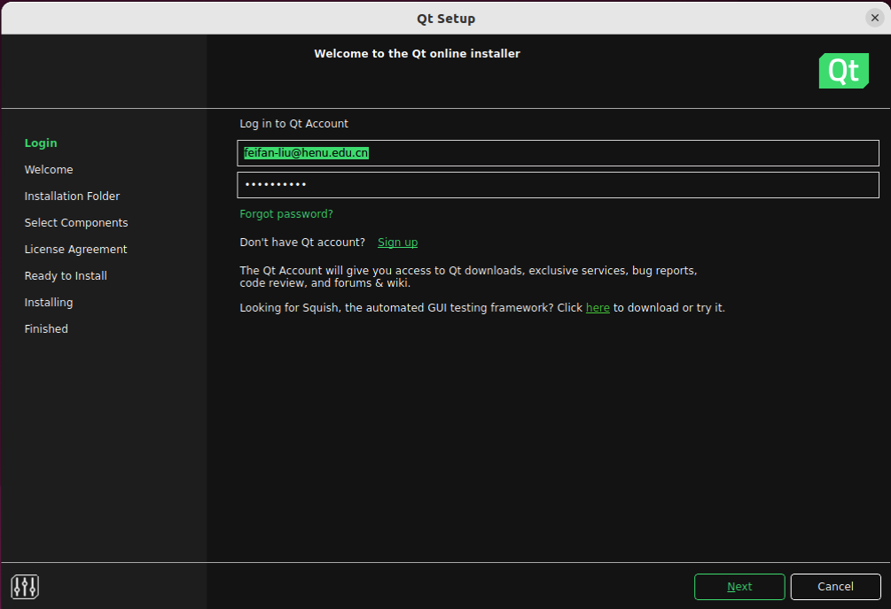
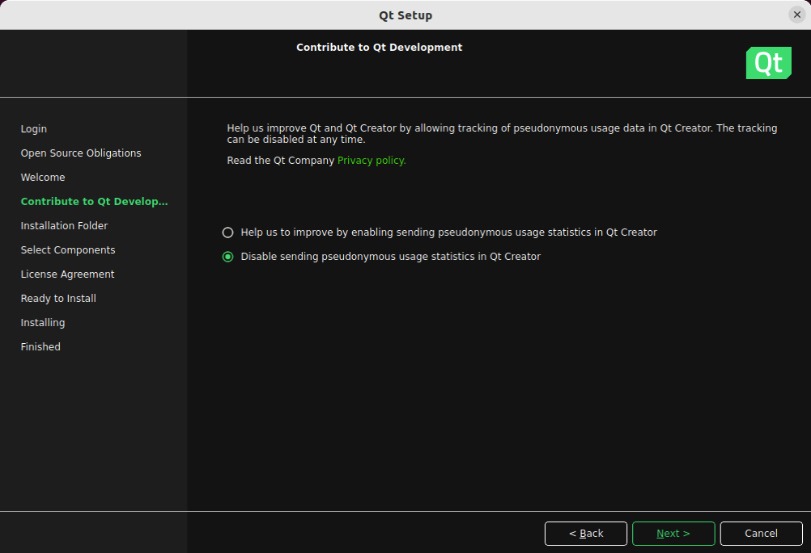
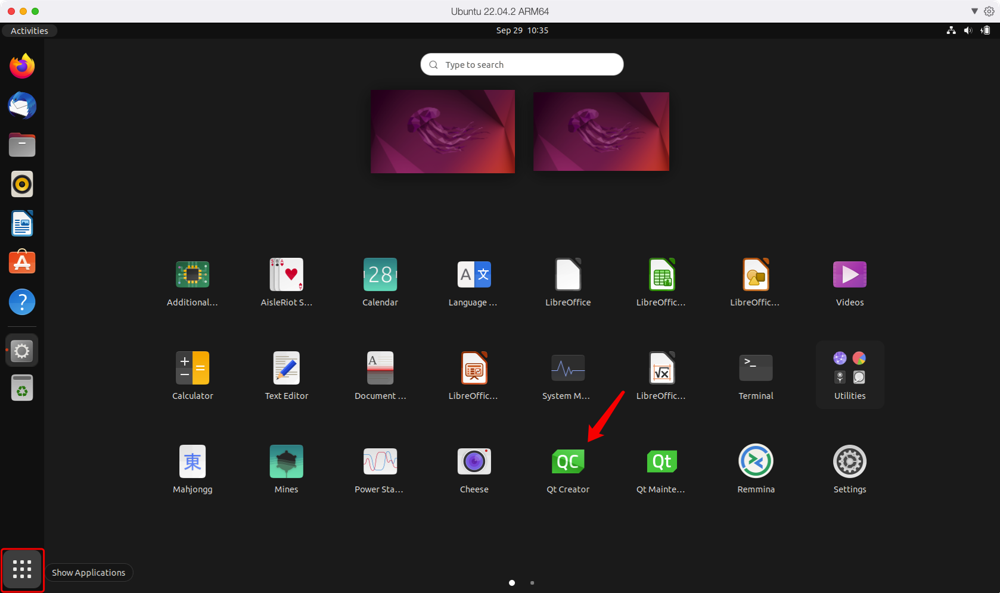
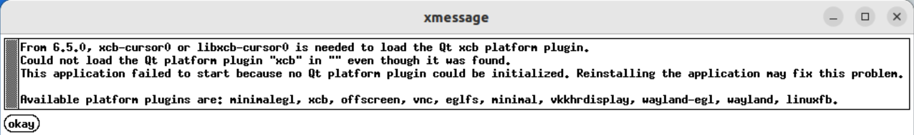
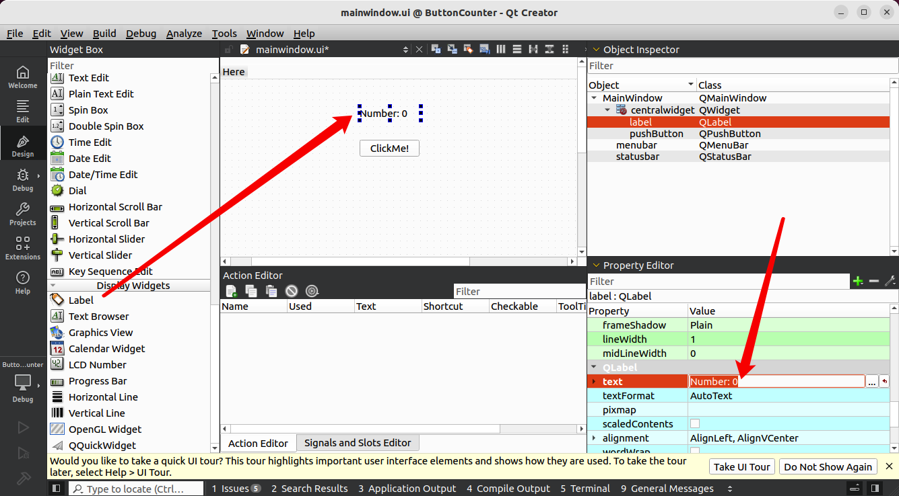
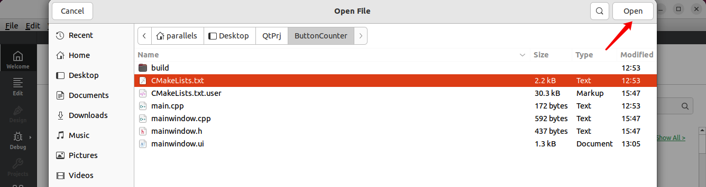

# EmbeddedExperiment

# 实验目的

- 熟悉Qt Creator开发环境的使用。
- 学习如何在Qt中创建一个基本的GUI应用程序。
- 理解Qt信号与槽机制的工作原理。
- 实现一个基本的计数器应用程序，按钮每次点击时，计数器加一。

# 实验环境准备

1. **Qt版本**：确保你已经安装了Qt Creator，可以从[Qt官网](https://www.qt.io)下载最新版本。
2. **操作系统**：Windows、MacOS 或 Linux 均可。

# 安装Qt

在Ubuntu系统的浏览器打开这个链接：[Qt在线安装器](https://www.qt.io/download-qt-installer-oss?hsCtaTracking=99d9dd4f-5681-48d2-b096-470725510d34|074ddad0-fdef-4e53-8aa8-5e8a876d6ab4)

如果网页响应过慢可以科学上网。

选择Linux x64并下载。


找到下载的文件，打开终端输入`chmod +x  `后拖入文件，回车后即可为该文件添加可执行权限。


在浏览器中注册Qt账号并输入，点击下一步。



该勾选的勾选上，下一步后继续下一步。


可选择不发送统计信息到Qt，下一步。



选择为桌面开发，下一步。


同意协议后下一步，点击安装即出现下载安装界面。国内也是可以正常下载的，如果有下载问题可点击重试。


安装完成后，在左下角应用里找到Qt Creator并打开。



如果显示下述界面，则提示运行Qt需要安装依赖项。



在命令行输入安装指令并回车，安装完成后打开Qt Creator即可。

```bash
sudo apt install libxcb-cursord
```

# 创建项目

首先，打开Qt Creator，按照以下步骤创建一个新的Qt Widgets应用程序：

1. 在Qt Creator中点击“文件” -> “新建项目”。

   

2. 在弹出的窗口中，选择“应用程序”下的“Qt Widgets Application”。

   

3. 设置项目名称，例如“ButtonCounter”，并选择保存路径。

   

4. 后续的选择页面，默认选择即可，继续点击“下一步”直到项目创建完成。

创建项目后，Qt会自动生成几个重要的文件，包括：

- **main.cpp**：程序入口文件。
- **mainwindow.ui**：主窗口的UI设计文件。
- **mainwindow.h** 和 **mainwindow.cpp**：主窗口类的头文件和实现文件。


# 设计用户界面


打开`mainwindow.ui`，进入Qt的可视化UI设计器，按以下步骤设计界面：

1. 从左侧的“Widget Box”中拖拽一个**Push Button**到中央界面，并将按钮的`text`属性设置为“ClickMe!”。

   

2. 再拖拽一个**Label**用于显示点击次数，默认显示文本为“Number: 0”。

   

3. 调整按钮和标签的位置和大小，以确保布局合理。

设计完成后，记得保存UI设计（Ctrl+S）。

# 实现信号与槽连接

## 在头文件中定义计数器变量

打开`mainwindow.h`，在主窗口类的私有部分添加一个整数类型的成员变量`clickCount`，用于存储按钮的点击次数：

```cpp
private:
    int clickCount;  // 计数器变量
```


## 初始化计数器

在`mainwindow.cpp`的构造函数中初始化计数器变量：

```cpp
MainWindow::MainWindow(QWidget *parent)
    : QMainWindow(parent)
    , ui(new Ui::MainWindow)
    , clickCount(0)  // 初始化点击次数
{
    ui->setupUi(this);
}
```

下图中红色为修改行：


## 编写槽函数

接下来，在`mainwindow.cpp`中编写槽函数，当按钮被点击时触发，更新计数并显示在标签中：

```cpp
void MainWindow::on_pushButton_clicked()
{
    clickCount++;  // 点击次数加1
    ui->label->setText("Number: " + QString::number(clickCount));  // 更新标签显示
}
```


完成代码编写后，Ctrl+S保存变更。

## 连接信号与槽

在Qt Designer中，你可以右键点击按钮，选择“转到槽”，然后选择`clicked()`信号，Qt会自动在代码中生成槽函数的声明。


当然，如果你想手动连接信号与槽，也可以在构造函数中使用以下代码：

```cpp
connect(ui->pushButton, &QPushButton::clicked, this, &MainWindow::on_pushButton_clicked);
```

这段代码表示，当按钮被点击时，`clicked()`信号被触发，继而执行`on_pushButton_clicked()`槽函数。

# 编译与运行项目

Creator会自动配置Cmake，无需手动编写。但是左下角的运行调试编译的按钮是灰色的。

**如果你的按钮是彩色的，则不需要进安装依赖的操作。**

> 查看报错信息发现我的Ubuntu缺少OpenGL相关的库，而这些库是Qt6的Qt6Gui和Qt6Widgets组件的依赖项。
>
> 
>
> 在终端执行：
>
> ```bash
> sudo apt install libgl1-mesa-dev libglu1-mesa-dev freeglut3-dev
> ```
>
> 安装完成后重启相应服务，输入`1 2 3 4`并回车。
>
> 重新打开Qt，打开文件或工程，选择项目的Cmake文件，此时Creator会自动配置Cmake，三个按钮已经变成彩色。
>
> 

点击“运行”按钮，Qt Creator会编译项目并启动应用程序。点击按钮时，标签中的点击次数会随着按钮点击而更新。


# 信号与槽机制的详细解读

## 信号与槽的基本原理

在Qt中，信号（signal）是一个事件的发射器，而槽（slot）是一个事件的处理器。信号与槽机制允许不同对象之间进行松耦合的通信，也就是说，信号的发射者和接收者并不需要直接知道彼此的存在。通过使用`QObject::connect()`函数，开发者可以将信号和槽连接起来。

例如，按钮（`QPushButton`）有一个内置的`clicked()`信号，表示按钮被点击。你可以将这个信号与任意的槽函数连接起来，例如一个用于更新标签的槽函数。当按钮被点击时，`clicked()`信号会触发，槽函数则会响应更新显示内容。

## 连接信号与槽的语法

在Qt 5及更高版本中，使用了更现代的信号与槽连接语法。基本语法如下：

```cpp
QObject::connect(sender, &SenderClass::signal, receiver, &ReceiverClass::slot);
```

其中：
- `sender`是信号的发送者（例如按钮对象）。
- `signal`是发送者发出的信号（如`clicked()`）。
- `receiver`是接收信号的对象。
- `slot`是接收者的槽函数。

这一机制使得Qt的事件处理更加直观和灵活。你也可以使用lambda表达式或自由函数作为槽，这在处理临时任务时非常有用。

## 更复杂的信号与槽用法

在Qt中，不仅可以将信号连接到槽，还可以将一个信号连接到另一个信号，甚至可以跨线程连接信号与槽。信号与槽机制的强大之处在于其类型安全性和灵活性——编译时会检查连接的合法性，而在运行时，信号的传递方式确保了线程安全。

# 实验发挥部分

## 图片切换器

点击按钮依次切换显示不同的图片。

## 滑块与进度条同步

滑块的值实时反映在进度条上，滑动时同步更新。

## 弹出对话框

点击按钮后，弹出消息框或确认对话框、

## 复选框启用按钮

当选中复选框时，按钮被启用，取消勾选则禁用按钮。

# 小组协作

| 姓名   | 安装Ubuntu | Git协作 | Markdown语法 | Linux基础 | Qt安装 | 信号与槽 | 自主发挥 |
| ------ | ---------- | ------- | ------------ | --------- | ------ | -------- | -------- |
| 刘非凡 |            |         |              |           |        |          |          |
|        |            |         |              |           |        |          |          |
|        |            |         |              |           |        |          |          |


