# 嵌入式Linux 实验六

# 实验目的

- 熟悉Qt Creator开发环境的使用。
- 学习如何在Qt中创建一个基本的GUI应用程序。
- 理解Qt信号与槽机制的工作原理。
- 实现一个基本的计数器应用程序，按钮每次点击时，计数器加一。

# 实验环境准备

1. **Qt版本**：Qt Creator 6.8.0
2. **操作系统**：Ubuntu 22.04.2

# 安装Qt

在Ubuntu系统的浏览器打开这个链接：[Qt在线安装器](https://www.qt.io/download-qt-installer-oss?hsCtaTracking=99d9dd4f-5681-48d2-b096-470725510d34|074ddad0-fdef-4e53-8aa8-5e8a876d6ab4)

如果网页无响应可以**科学上网**。

选择**Linux x64**并下载。

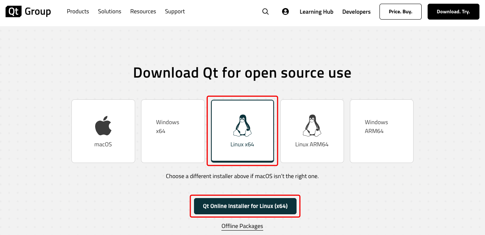

找到下载的文件，打开终端输入`chmod +x  `后拖入文件，回车后即可为该文件添加**可执行权限**。

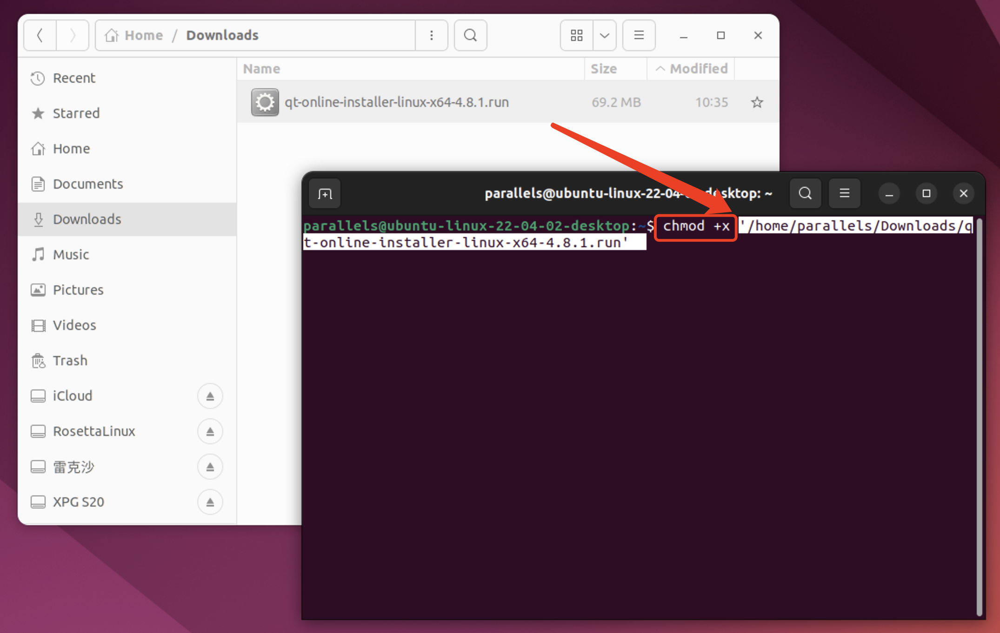

需要你在[Qt官网](https://www.qt.io/)中完成Qt账号的注册。返回Qt安装程序，输入账号密码，点击下一步。

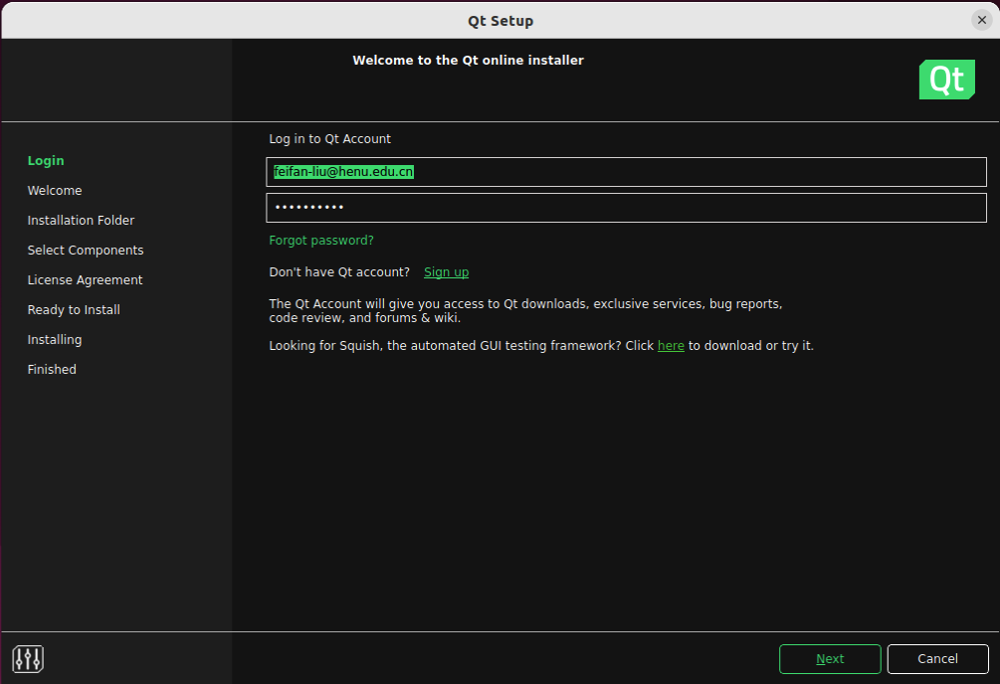

该勾选的勾选上，下一步后继续下一步。

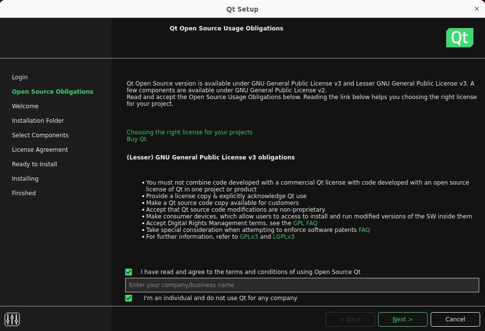

可选择**不发送统计信息**到Qt，下一步。

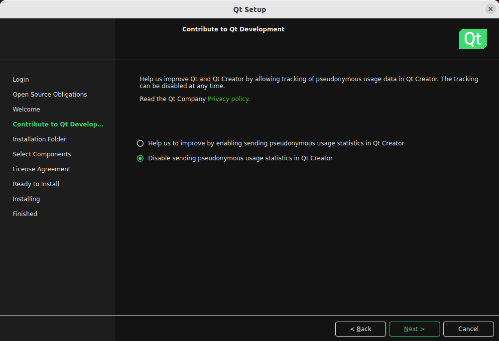

选择**为桌面开发**，下一步。

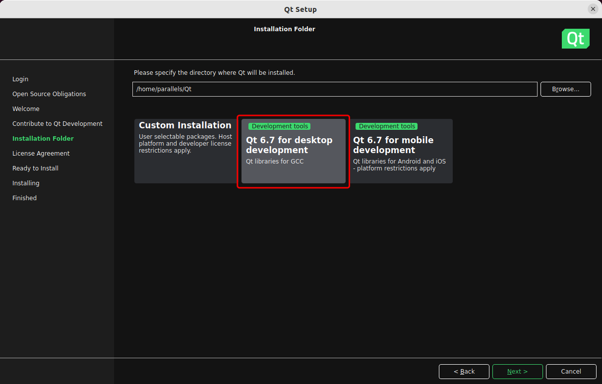

同意协议后下一步，点击安装即出现下载安装界面。国内也是可以正常下载的，如果有下载问题可点击重试。

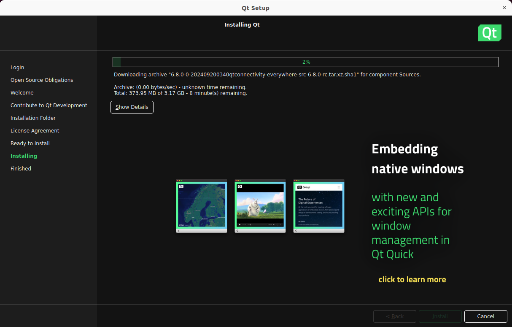

安装完成后，在左下角应用里找到**Qt Creator**并打开。

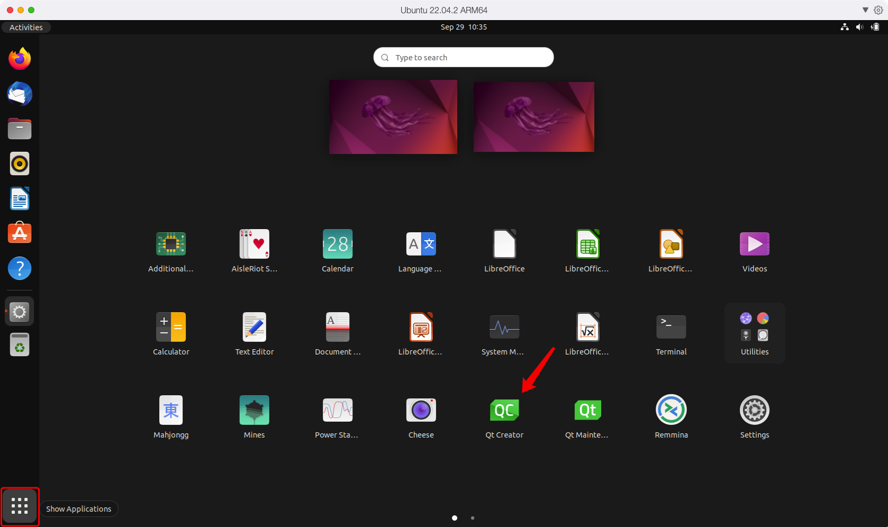

> **如果显示下述界面**，则提示运行Qt需要安装依赖项。
>
> 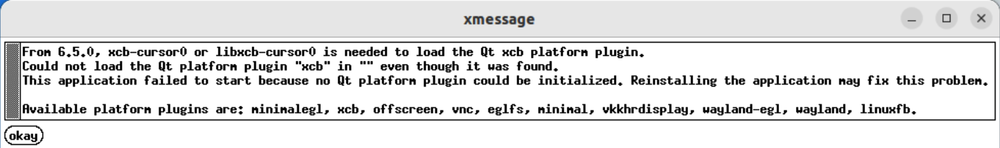
>
> 在**终端**输入安装指令并回车，安装完成后打开Qt Creator即可。
>
> ```bash
> sudo apt install libxcb-cursor0
> ```

# 创建项目

首先，打开Qt Creator，按照以下步骤创建一个新的Qt Widgets应用程序：

1. 在Qt Creator中点击“文件” -> “新建项目”。

   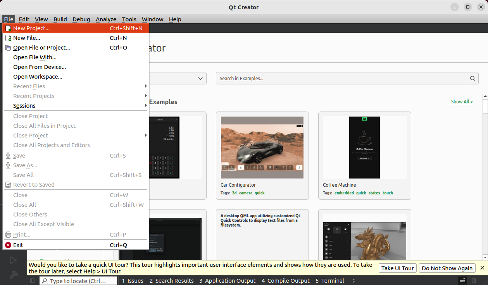

2. 在弹出的窗口中，选择“应用程序”下的“Qt Widgets Application”。

   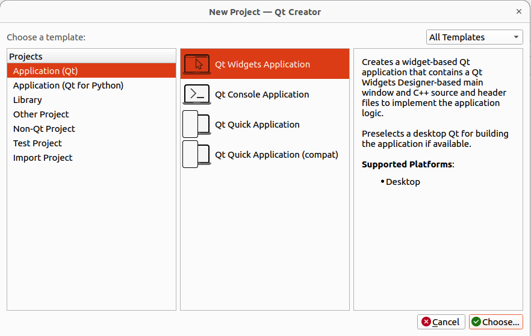

3. 设置项目名称，例如“ButtonCounter”，并选择保存路径。

   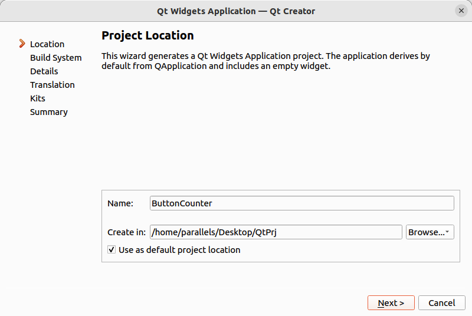

4. **后续的选择页面保持默认**即可，继续点击“下一步”直到项目创建完成。

创建项目后，Qt会自动生成几个重要的文件，包括：

- **main.cpp**：程序入口文件。
- **mainwindow.ui**：主窗口的UI设计文件。
- **mainwindow.h** 和 **mainwindow.cpp**：主窗口类的头文件和实现文件。

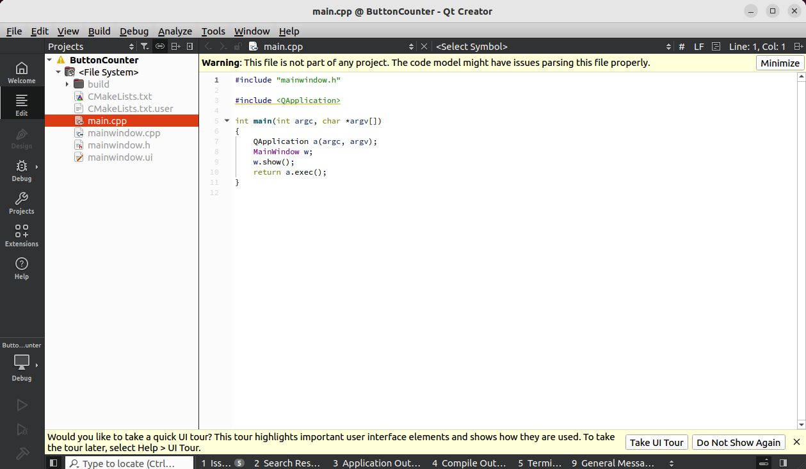

# 设计用户界面

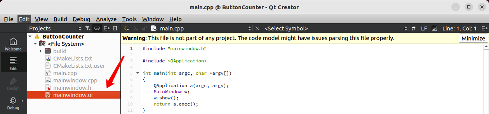

打开`mainwindow.ui`，进入Qt的可视化UI设计器，按以下步骤设计界面：

1. 从左侧的“Widget Box”中拖拽一个**Push Button**到中央界面，并将按钮的`text`属性设置为“ClickMe!”。

   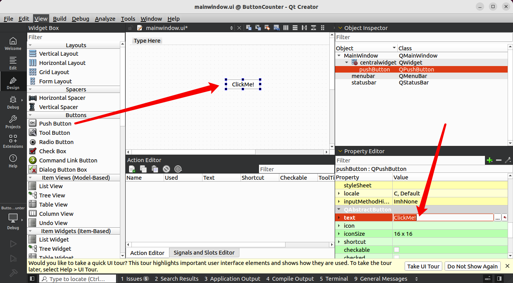

2. 再拖拽一个**Label**用于显示点击次数，默认显示文本为“Number: 0”。

   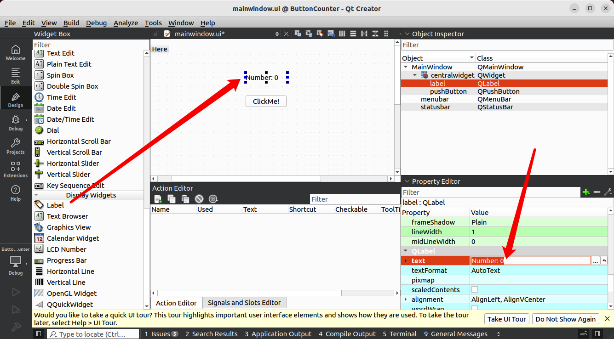

3. 调整按钮和标签的位置和大小，以确保布局合理。

设计完成后，记得保存UI设计（Ctrl+S）。

# 信号与槽机制的解读

在Qt编程中，**信号与槽机制**是用于在对象之间传递信息的一种灵活机制。它的关键作用在于**解耦合**，即发出信号的一方不需要知道接收方是谁，也不需要关心它如何处理这个信号。

### 为什么不直接操作？

在很多情况下，我们希望不同的对象之间能保持独立性。例如，假设你在开发一个复杂的应用程序，按钮的点击需要触发很多不同的操作：有的更新界面，有的保存数据，有的发送通知。如果每个按钮都直接控制这些操作，会让代码变得非常复杂和难以维护。

信号与槽机制的目的就是**简化通信流程**，让对象之间不用直接互相操作，而是通过信号的形式告诉系统“发生了什么事”，由系统将这个信号传递给相应的处理函数（槽）。

### 合适的例子

想象一下你在机场等飞机。机场有一个广播系统，负责通知乘客航班信息。这个广播系统可以理解为“信号”的发射者。机场的每位乘客就像是“槽”，接收这些信息并根据通知采取行动（例如：登机）。

这里的关键在于：

- **广播系统（信号）** 并不需要了解每个乘客的具体情况。它只负责发出消息。
- **乘客（槽）** 根据收到的信息自行决定要做什么，比如去登机口、继续等候等。

这个例子和信号与槽机制类似：信号只负责传递消息，至于消息由哪个对象接收、如何处理，完全是由槽来决定的。信号和槽之间可以是多对多的关系：一个信号可以连接多个槽，多个信号也可以连接同一个槽。

### 信号与槽的优势

1. **灵活性**：信号与槽使得程序各部分更加灵活，可以根据需要在运行时动态连接和断开信号与槽。
2. **解耦合**：发送信号的对象不需要了解接收者的内部细节，只需发出信号，由接收者（槽）处理。
3. **可扩展性**：通过信号与槽，程序可以轻松地添加新功能，而无需修改已有的代码。

# 实现信号与槽连接

## 在头文件中定义计数器变量

打开`mainwindow.h`，在主窗口类的私有部分添加一个整数类型的成员变量`clickCount`，用于存储按钮的点击次数：

```cpp
private:
    int clickCount;  // 计数器变量
```

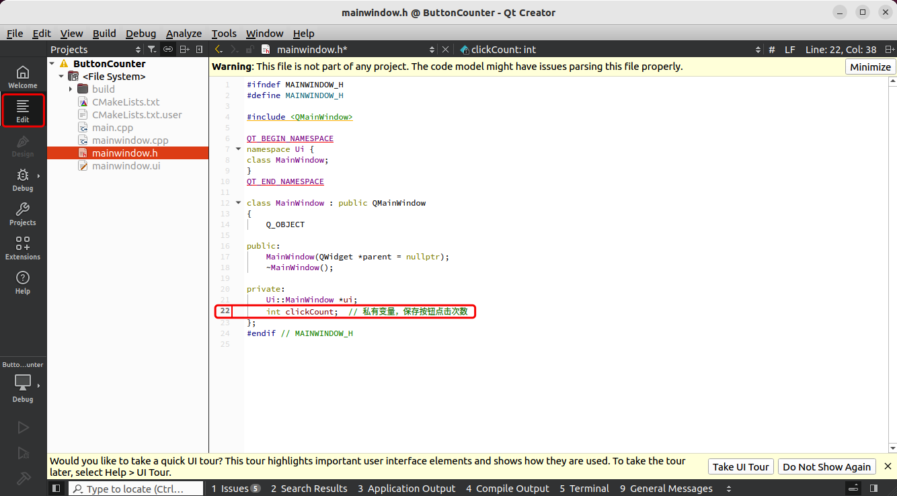

## 初始化计数器

在`mainwindow.cpp`的构造函数中初始化计数器变量：

```cpp
MainWindow::MainWindow(QWidget *parent)
    : QMainWindow(parent)
    , ui(new Ui::MainWindow)
    , clickCount(0)  // 初始化点击次数
{
    ui->setupUi(this);
}
```

下图中红色为修改行：

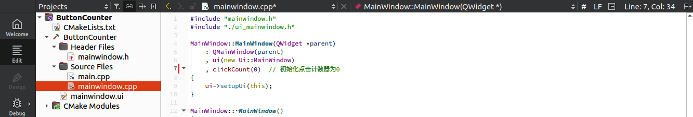

## 编写槽函数

接下来，在`mainwindow.cpp`中编写槽函数，当按钮被点击时触发，更新计数并显示在标签中：

```cpp
void MainWindow::on_pushButton_clicked()
{
    clickCount++;  // 点击次数加1
    ui->label->setText("Number: " + QString::number(clickCount));  // 更新标签显示
}
```

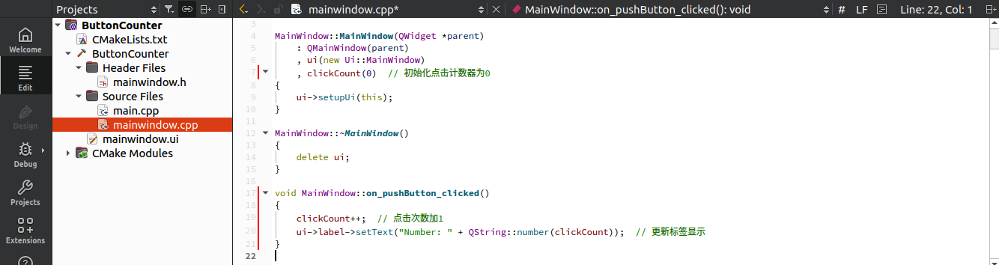

完成代码编写后，Ctrl+S保存变更。

## 连接信号与槽

在Qt Designer中，你可以右键点击按钮，选择“转到槽”，然后选择`clicked()`信号，Qt会自动在代码中生成槽函数的声明。

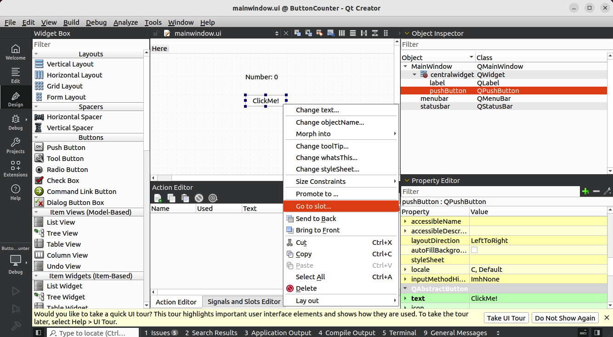

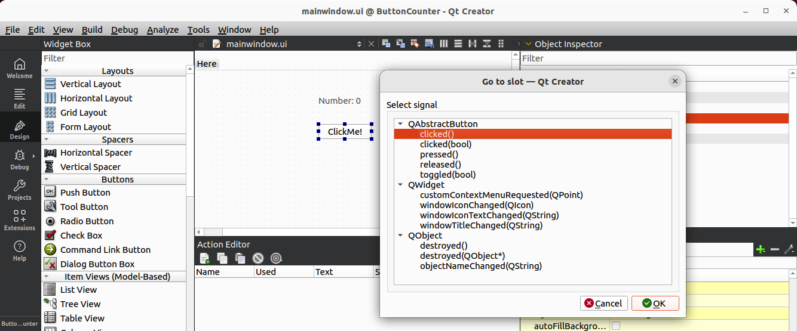

当然，如果你想手动连接信号与槽，也可以在构造函数中使用以下代码：

```cpp
connect(ui->pushButton, &QPushButton::clicked, this, &MainWindow::on_pushButton_clicked);
```

这段代码表示，当按钮被点击时，`clicked()`信号被触发，继而执行`on_pushButton_clicked()`槽函数。

# 编译与运行项目

Qt Creator会自动配置Cmake，无需手动编写。笔者的Creator左下角的运行调试编译的按钮是灰色的。

**如果你的按钮是彩色的，则不需要排查Cmake配置错误的操作。**

> 查看报错信息发现我的Ubuntu缺少OpenGL相关的库，而这些库是Qt6的Qt6Gui和Qt6Widgets组件的依赖项。
>
> 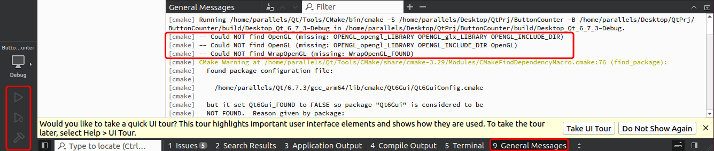
>
> 在终端执行：
>
> ```bash
> sudo apt install libgl1-mesa-dev libglu1-mesa-dev freeglut3-dev
> ```
>
> 安装完成后重启相应服务，输入`1 2 3 4`并回车。
>
> 重新打开Qt，打开文件或工程，选择项目的Cmake文件，此时Creator会自动配置Cmake，三个按钮已经变成彩色。
>
> 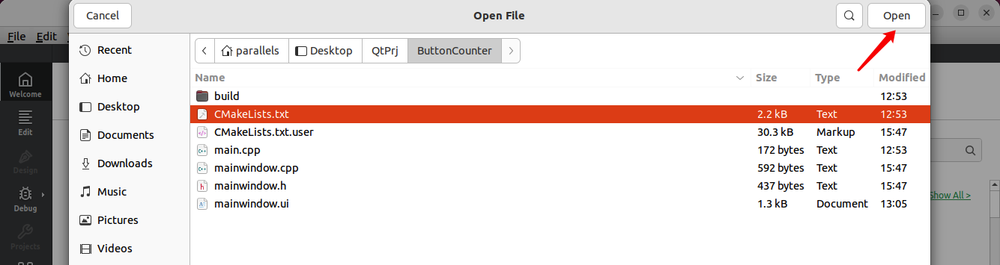

点击“运行”按钮，Qt Creator会编译项目并启动应用程序。点击按钮时，标签中的点击次数会随着按钮点击而更新。

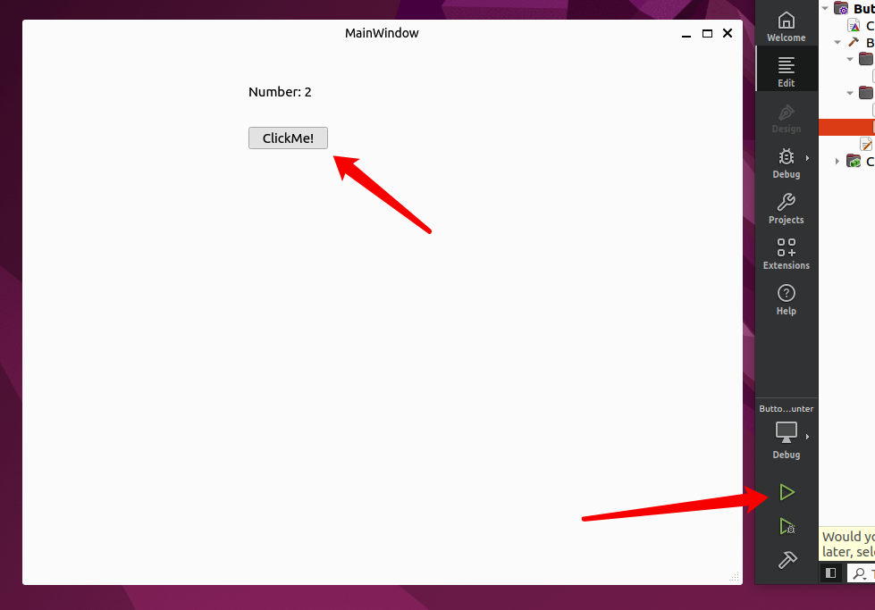

# 实验发挥部分

## 图片切换器

点击按钮依次切换显示不同的图片。

## 滑块与进度条同步

滑块的值实时反映在进度条上，滑动时同步更新。

## 弹出对话框

点击按钮后，弹出消息框或确认对话框。

## 复选框启用按钮

当选中复选框时，按钮被启用，取消勾选则禁用按钮。

# 小组协作

| 姓名 | 安装Ubuntu | Git协作 | Markdown语法 | Linux基础 | Qt安装 | 信号与槽 | 自主发挥 |
| ---- | ---------- | ------- | ------------ | --------- | ------ | -------- | -------- |
|      |            |         |              |           |        |          |          |
|      |            |         |              |           |        |          |          |
|      |            |         |              |           |        |          |          |
